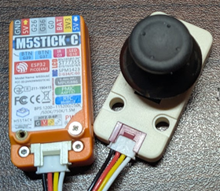
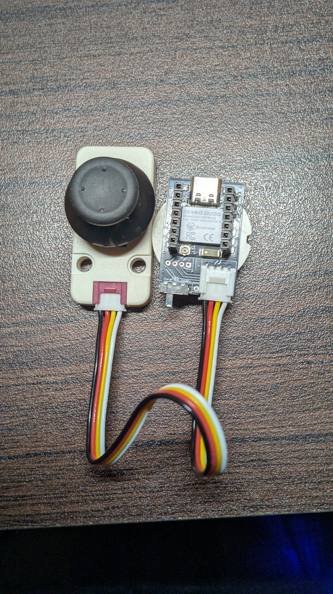
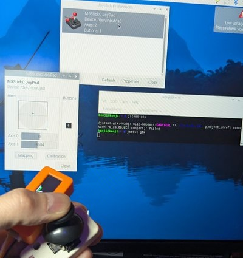

# M5StickC BLE JoyStick Controller

M5StickC / XIAO ESP32 + Grove JoyStick を BLE ゲームパッドとして動作させるプロジェクト。

| M5StickC + JoyStick | XIAO ESP32C6 + JoyStick |
|:-------------------:|:-----------------------:|
|  |  |

## 概要

Grove端子に接続したJoyStickの入力をBluetooth Low Energy (BLE) HID Gamepadとして送信します。
Raspberry Pi、Android、PCなどで汎用ゲームパッドとして認識されます。

## 対応ボード

| ボード | チップ | Bluetooth | 備考 |
|--------|--------|-----------|------|
| M5StickC | ESP32-PICO-D4 | BLE 4.2 + Classic | LCD表示あり |
| XIAO ESP32S3 | ESP32-S3 | BLE 5.0 | LED状態表示 |
| XIAO ESP32C3 | ESP32-C3 | BLE 5.0 | LED状態表示 |
| XIAO ESP32C6 | ESP32-C6 | BLE 5.0 | LED状態表示 |

## 対応JoyStick

以下のM5Stack JoyStickに対応（自動検出）:

| 製品 | I2Cアドレス | ADC | 購入リンク |
|------|-------------|-----|------------|
| I2Cジョイスティックユニット | 0x52 | 8bit (0-255) | [Switch Science](https://www.switch-science.com/products/8101) |
| ジョイスティックHat (MiniJoyC) | 0x54 | 8bit (0-255) | [Switch Science](https://www.switch-science.com/products/8781) |
| I2Cジョイスティックユニット RGB LED付き (STM32G030) | 0x63 | 16bit (0-65535) | [Switch Science](https://www.switch-science.com/products/9922) |

## 接続

### M5StickC
```
M5StickC Grove端子 ─── JoyStick Unit
  SDA (GPIO32)          SDA
  SCL (GPIO33)          SCL
  3.3V                  VCC
  GND                   GND
```

### XIAO ESP32シリーズ
| ボード | SDA | SCL |
|--------|-----|-----|
| XIAO ESP32S3 | GPIO5 | GPIO6 |
| XIAO ESP32C3 | GPIO6 | GPIO7 |
| XIAO ESP32C6 | GPIO22 | GPIO23 |

## 機能

- BLE HID Gamepad として認識
- 起動時に自動キャリブレーション
- JoyStickタイプ自動検出（V1/V2）
- デッドゾーン処理（中心付近のノイズ除去）
- M5StickC: LCD表示、BtnAをゲームパッドボタンとして使用
- XIAO: LED点滅（BLE待機中）/点灯（BLE接続中）

## 軸の値範囲

| 項目 | 値 |
|------|-----|
| 最小値 | 0 |
| 中心値 | 16383 |
| 最大値 | 32767 |

## ビルド

PlatformIO を使用:

```bash
# 全環境ビルド
pio run

# 特定環境のみ
pio run -e m5stick-c
pio run -e xiao_esp32s3
pio run -e xiao_esp32c3
pio run -e xiao_esp32c6

# アップロード
pio run -e xiao_esp32c6 -t upload

# シリアルモニタ
pio device monitor
```

## 使用ライブラリ

- M5StickC (M5StickCのみ)
- ESP32-BLE-Gamepad
- NimBLE-Arduino

## テスト状況

### ボード × JoyStick 組み合わせ

| ボード | JoyStick Unit (0x52) | JoyStick Hat (0x54) | JoyStick RGB (0x63) |
|--------|:--------------------:|:-------------------:|:-------------------:|
| M5StickC | ✅ 動作確認済 | ❌ 未テスト | ❌ 未テスト |
| XIAO ESP32S3 | ❌ 未テスト | ❌ 未テスト | ❌ 未テスト |
| XIAO ESP32C3 | ❌ 未テスト | ❌ 未テスト | ❌ 未テスト |
| XIAO ESP32C6 | ✅ 動作確認済 | ❌ 未テスト | ❌ 未テスト |

### 接続先デバイス

- ✅ Android (Gamepad Tester アプリ)
- ✅ Raspberry Pi 4

### Raspberry Pi接続例



## 参考

- [M5StickC_Gamepad](https://github.com/esikora/M5StickC_Gamepad)
- [ESP32-BLE-Gamepad](https://github.com/lemmingDev/ESP32-BLE-Gamepad)

## License

MIT
